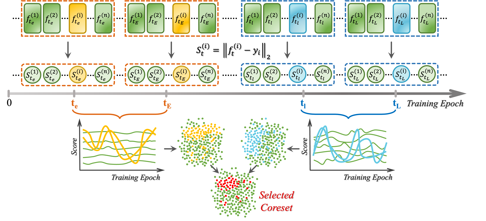

# EVA
This repo contains the Pytorch implementation of our paper: 
> [**Evolution-aware VArance (EVA) Coreset Selection for Medical Image Classification**](https://arxiv.org/pdf/2406.05677.pdf)
>
> Yuxin Hong, Xiao Zhang, Xin Zhang, Joey Tianyi Zhou.

- **Accepted at ACMMM 2024 as Oral Presentation.**
- :tada: [**Nominated for Best Paper Awards**](https://2024.acmmm.org/best-paper).

## :computer: Installation and Requirements

We strongly recommend that you create your own virtual environment first to avoid conflicts. Then setup the required Python environments:
    
    pip install requirements.txt

### Dataset

We validate the effectiveness of EVA mainly on [MedMNIST](https://medmnist.com/). 
Install `medmnist` as a standard Python package from [PyPI](https://pypi.org/project/medmnist/):

    pip install medmnist

Or install from source:

    pip install --upgrade git+https://github.com/MedMNIST/MedMNIST.git

Check whether you have installed the latest code [version](core/data/medmnist_info.py#L1):

    >>> import medmnist
    >>> print(medmnist.__version__)

Please download `.npz` files from [here](https://zenodo.org/records/10519652) to `/.medmnist` directory.

## 🏃‍♀️ Getting Started

### Train Classifiers on the Entire Dataset
This step is **necessary** to collect training dynamics for future coreset selection.

    python train.py --dataset organsmnist --gpuid 0 --epochs 200 --lr 0.1 --network resnet18 --batch_size 256 --task_name all-data --base_dir ./data-model/organsmnist --download --as_rgb
    
After completing this step, you will obtain a `.pickle` file under the path `./data-model/organsmnist/all-data`, which will be used for sample importance calculation.

### Sample Importance Score Calculation
We need to first calcualte the different importance scores for coreset selection.

    python generate_importance_score.py --dataset organsmnist --gpuid 0 --base_dir ./data-model/organsmnist --e_min 0 --e_max 10 --l_min 100 --l_max 110 --task_name all-data --as_rgb

After the calculation, you will obtain a `.pickle` file storing sorted sample indexes and their respective importance scores.

### Train Classifiers on the Selected Coreset
Here we use 30% selection rate on OrganSMNIST as an example.
    
    python train.py --dataset organsmnist --gpuid 0 --epochs 200 --base_dir ./data-model/organsmnist/eva --coreset --coreset_mode coreset --data-score-path ./data-model/organsmnist/all-data/data-score-all-data-0-10-100-110.pickle --coreset_key eva --as_rgb --task_name eva-0-10-100-110-0.3  --coreset_ratio 0.3

* For an aggressive low selection rate, pls set a smaller batch size for better performance.

## :thumbsup: Citation
If you find our work useful for your research, please cite our paper:

    @inproceedings{Hong2024EVA,
        author = {Hong, Yuxin and Zhang, Xiao and Zhang, Xin and Zhou, Joey Tianyi},
        title = {Evolution-aware VAriance (EVA) Coreset Selection for Medical Image Classification},
        year = {2024},
        booktitle = {Proceedings of the 32nd ACM International Conference on Multimedia},
        pages = {301–310},
        location = {Melbourne VIC, Australia},
    }
